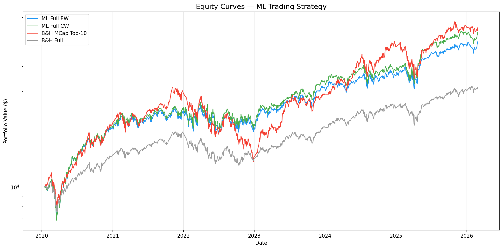

# ML Cross-Sectional Stock Selection — NASDAQ-100-style Universe


End-to-end machine learning pipeline that selects a top-`k` long-only basket from
a 72-ticker NASDAQ-100-style universe, rebalances every 10 trading days, and
beats the QQQ benchmark on both absolute return and risk-adjusted return over
2020-2026 — though without formal statistical significance (alpha p-value
≈ 0.06–0.21 depending on test).

This repository is a final-year thesis project (v1 sealed 2026-04-21).



---

## 1. Headline results

Period: **2020-01-16 → 2026-02-26** (~6 years, the model's prediction window).
Initial capital $10,000, transaction cost 10 bps round-trip, slippage 2 bps.

| Strategy | CAGR | Sharpe | MDD | Calmar | Alpha vs QQQ (annual) | p-value |
|---|---:|---:|---:|---:|---:|---:|
| ✅ **ML_Full_CW** (production) | **33.3%** | **0.89** | -37.6% | 0.89 | **+11.7%** | 0.12 (HAC) / 0.06 (bootstrap) |
| ✅ ML_Full_EW (production) | 30.9% | 0.85 | -37.2% | 0.83 | +9.2% | 0.21 / 0.09 |
| ⚪ BH_QQQ (benchmark) | 18.6% | 0.67 | -35.1% | 0.53 | — | — |
| ⚠️ BH_MCap10 (top-10 by mcap) | 34.1% | 0.90 | -57.5% | 0.59 | — | — |

The ML strategy delivers BH_MCap10-class CAGR with materially better drawdown
(-37.6% vs -57.5%) and beats the broad QQQ benchmark on every dimension. The
alpha is economically meaningful but not statistically significant at the 5%
level — see §7 Limitations.

A research finding (`CW + sector_max_weight=0.30`) improves CAGR to ~35.4%
while keeping MDD unchanged, but is reported as a **v2 candidate** rather than
a production change to preserve the holdout window's integrity. See
[`notebooks/07_overlay_tuning.ipynb`](notebooks/07_overlay_tuning.ipynb).

### Predictive-signal quality (Information Coefficient)

The IC story has two layers — both honestly reported:

1. **Best single-feature |IC| ceiling ≈ 0.05-0.06.** Three independent
   feature-selection studies (rolling IC, MDA, Boruta) on the free-tier
   feature set converge on this number; the top single feature is
   `rolling_beta_63d` with mean |IC| = 0.0557 (`docs/notes/v1_changelog.md`
   §9). Theoretical ensemble-IC ceiling under realistic positive
   feature correlation: ~0.08-0.12. Per Grinold & Kahn's *Active Portfolio
   Management*, an IC of 0.05-0.10 is "world-class on a large universe" —
   so the **feature ceiling itself is competitive**.

2. **Realised production-ensemble OOS IC ≈ 0.01.** Computed as the daily
   cross-sectional Spearman of the adaptive-ensemble score against forward
   return, averaged over 1,467 OOS days. The model captures roughly 15-20%
   of the theoretical feature-ceiling signal. Modest in absolute terms but
   consistent — via the Fundamental Law of Active Management
   (IR = IC × √breadth)¹ — with delivering Sharpe 0.89 on a 72-name
   universe. See §7 for the honest caveat: the gap between the
   feature-ceiling IC and the realised ensemble IC is the binding
   constraint on further alpha.

¹ *Raw breadth = 72; effective breadth is materially lower because of mega-cap
tech concentration (AAPL, MSFT, NVDA, GOOGL, META, AMZN, TSLA carry cross-
sectional correlations ≈ 0.6-0.8). Using the Clarke–de Silva–Thorley (2002)
correction, effective breadth on a tech-heavy NDX-100 typically lands in the
20-30 range, not 72. The IR estimate above is therefore an upper bound.*

### Statistical robustness checks

**Sharpe ratio uncertainty** (Lo 2002 SE, accounting for skew and excess
kurtosis of daily returns):

| Strategy | Sharpe | SE | 95% CI |
|---|---:|---:|:--|
| ML_Full_CW | 0.89 | 0.40 | [+0.10, +1.68] |
| ML_Full_EW | 0.85 | 0.40 | [+0.06, +1.64] |
| BH_QQQ | 0.67 | 0.42 | [-0.15, +1.48] |

The CIs overlap heavily — ML's Sharpe edge over QQQ is consistent with the
data but cannot be distinguished from sampling noise at 95% confidence on a
6-year window. (This mirrors the alpha p-value picture in the headline table.)

**Deflated Sharpe Ratio** (Bailey & López de Prado 2014) corrects for
multiple-testing inflation under the null that all candidate strategies have
zero true Sharpe:

| n_trials | E[max SR] | ML_Full_CW p_DSR | ML_Full_EW p_DSR |
|---:|---:|---:|---:|
| 3 (LR + RF + LGBM) | 0.34 | 0.088 | 0.105 |
| 5 (+ EW & CW variants) | 0.48 | 0.156 | 0.180 |
| 10 (+ overlay grid in NB07) | 0.64 | 0.265 | 0.298 |
| 20 (+ feature-selection sweeps) | 0.77 | 0.382 | 0.419 |

ML_Full_CW's observed Sharpe **exceeds** the expected-maximum-under-H₀ at every
plausible n_trials, meaning the result is directionally consistent with real
skill rather than pure search inflation — but p_DSR remains > 5% at the higher
n_trials counts honest accounting would assign. See implementation in
[`src/backtest/engine.py:deflated_sharpe_ratio`](src/backtest/engine.py).

**Cost sensitivity** — Sharpe and CAGR across round-trip cost levels (full
production CW, all other settings unchanged):

| cost_bps | CAGR | Sharpe | MDD | vs QQQ Sharpe (0.67) |
|---:|---:|---:|---:|:--|
| 0 | 35.5% | 0.94 | -37.6% | +0.27 ✅ |
| 5 | 34.4% | 0.92 | -37.6% | +0.25 ✅ |
| **10 (production)** | **33.3%** | **0.89** | **-37.6%** | **+0.22 ✅** |
| 15 | 32.2% | 0.87 | -37.7% | +0.20 ✅ |
| 20 | 31.2% | 0.85 | -37.7% | +0.18 ✅ |
| 30 (pessimistic retail) | 29.1% | 0.80 | -37.8% | +0.13 ✅ |

Even at 30 bps round-trip — well above realistic retail execution for liquid
NDX-100 names — the strategy stays Sharpe-positive versus the QQQ benchmark.
Source: [`outputs/metrics/sensitivity_cost.csv`](outputs/metrics/sensitivity_cost.csv).

### Why this matters

Most undergraduate trading projects compare a single model to SPY. This one
tests whether a disciplined cross-sectional ML pipeline — with walk-forward CV,
purged K-fold inner tuning, triple-barrier labels, López de Prado sample
weights, and HAC+bootstrap alpha tests — can clear two meaningful bars:
(1) beat a **naive QQQ** allocation on both return and risk-adjusted return,
(2) match the **concentrated MCap-10 benchmark's** CAGR while cutting the
drawdown by ~20 percentage points. It clears both, and it tells you honestly
where the limits are (IC ceiling, 5% significance, single regime).

---

## 2. What the project does

```
Tiingo + Treasury + Yahoo (macro/VIX) APIs
            │
            ▼
   Data pipeline (raw → QC → align)
            │
            ▼
   Feature engineering (~80 features)
            │
            ▼
   Triple Barrier + forward-rebalance labeling
            │
            ▼
   Walk-forward training: LR + RF + LightGBM (random_state=42)
            │
            ▼
   Adaptive ensemble (per-fold OOS-weighted) + stacking variant
            │
            ▼
   Top-k portfolio + rebalance + cost model
            │
            ▼
   Equity curves, alpha tests (HAC + block bootstrap), reporting mart
```

- **Universe:** 72 tickers from the NASDAQ-100 (static snapshot — no historical
  membership drift modeled). The other ~28 NDX members were dropped because they
  lacked continuous Tiingo coverage from 2016-01-01 onward (late IPOs, missing
  history, or ticker changes), which would break the walk-forward training window.
- **Date range:** training data 2016-01-01 → 2026-03-01; first prediction
  produced 2020-01-16 after the walk-forward warm-up window.
- **Signal:** ensemble of LR (scaled features), RF (cross-sectionally ranked
  features), LightGBM ranker (uses aligned forward returns when present).
- **Ensemble:** the **production headline uses the `adaptive` method**
  (per-fold OOS-weighted blend of the three base models). A `stacking`
  meta-model variant is also fit and saved for ablation, but is **not** used
  in any reported backtest number.
- **Portfolio:** long-only top-10, rebalanced every 10 trading days, 25%
  single-stock cap, 40% sector cap, optional confidence-weighting (CW variant).
- **Regime handling:** the market regime (`p_high_vol`) is injected as a
  **feature**, not a post-hoc overlay — the model learns its own response to
  volatility bursts. This replaces the original `ML_Full_Adaptive` strategy
  (vol/regime/SMA risk gates), which was **removed** in v1 after
  [`docs/notes/adaptive_overlay_dropped.md`](docs/notes/adaptive_overlay_dropped.md)
  showed it cut alpha faster than it cut drawdown (α = −13.35%, p = 0.025).
- **Risk overlays available:** vol targeting, regime gate, SMA trend gate,
  drawdown stop, breadth gate, sector cap. Only sector cap is on by default in
  production. Vol/regime/SMA were tuned in `notebook 07` and dropped. See
  [`docs/notes/v1_changelog.md`](docs/notes/v1_changelog.md).

---

## 3. Repository structure

```
.
├── __main__.py                Allows `python -m .` to run the full pipeline
├── README.md                  This file
├── PROJECT_AUDIT_AND_RISK_NOTES.md   Health-check and risk-control reference
├── pyproject.toml             Package metadata + console script `ml-trading-run`
├── requirements.txt           Pinned dependency mins (mirrors pyproject deps)
├── pytest.ini                 Pytest config
├── .env.example               Template for TIINGO_API_KEY / FRED_API_KEY
├── .gitignore                 Excludes data + secrets; ships predictions + outputs
├── .dockerignore              Build-context filter for Docker
├── Dockerfile                 Two-stage Python 3.11 + LightGBM image
├── docker-compose.yml         Services: pipeline, data, features, backtest, test
├── .github/workflows/ci.yml   GitHub Actions CI (Python 3.10 / 3.11 / 3.12)
├── configs/
│   └── base.yaml              Single source of truth for all parameters
├── data/
│   ├── raw/cache/             Tiingo cache (gitignored — regenerated from API)
│   ├── interim/               Intermediate frames (gitignored)
│   └── processed/             Featured + labeled datasets (gitignored)
│       └── predictions_ens_full.parquet   COMMITTED — feeds Option B / D below
├── notebooks/
│   ├── 01_data_etl.ipynb      Universe + price quality
│   ├── 02_features.ipynb      Feature distributions, leakage checks
│   ├── 03_labeling.ipynb      Triple Barrier + forward labels
│   ├── 04_models.ipynb        Walk-forward CV + ensemble
│   ├── 05_backtesting.ipynb   Equity curves vs benchmarks
│   ├── 06_analysis.ipynb      Alpha tests, sensitivity, $10k journey
│   ├── 07_overlay_tuning.ipynb   Risk-overlay grid search (research)
│   └── 08_v2_tuning_postmortem.ipynb   v2 hyperparameter-tuning postmortem
├── experiments/
│   └── v2_hyperparam_tuning/  Optuna TPE tuning per fold (NEGATIVE result,
│                              not promoted — see experiments/.../README.md)
├── scripts/
│   ├── _common.py             Shared CLI argparse + logging setup
│   ├── run_all.py             8-step end-to-end pipeline
│   ├── run_data_pipeline.py   Step 1 — fetch + align
│   ├── run_features.py        Step 2 — feature engineering
│   ├── run_labeling.py        Step 3 — labeling
│   ├── run_models.py          Steps 4-5 — walk-forward + ensemble
│   ├── run_backtest.py        Step 6 — backtest
│   ├── run_analysis.py        Step 7 — alpha + sensitivity
│   ├── export_reporting.py    Step 8 — Power BI / reporting mart
│   └── diagnose_processed_data.py   Health-check helper
├── src/
│   ├── config.py              Typed config loader, SECTOR_MAP (72 tickers)
│   ├── data/                  Fetchers, QC, alignment, dataset build
│   ├── features/              Technical, vol, relative, macro, regime, cross-sectional
│   ├── labeling/              Triple Barrier + forward-rebalance labels
│   ├── splits/                Purged + embargoed walk-forward splits
│   ├── models/                Train, tune, ensemble (adaptive + stacking)
│   ├── backtest/              Engine, metrics, alpha tests, trade log
│   └── utils/                 IO, stats, feature importance
├── tests/                     13 pytest files: regression, leakage, signal-fidelity,
│                              treasury-fetch, ranker-safety, project-structure
├── outputs/                   Equity curves (12 .parquet), figures, metrics, reporting
│   └── logs/                  Runtime logs (gitignored — regenerated each run)
└── docs/notes/
    ├── v1_changelog.md            Decision log for v1
    ├── v1_roadmap.md              v2 candidates and open problems
    └── adaptive_overlay_dropped.md   Why ML_Full_Adaptive was removed
```

---

## 4. How to run

Four ways to interact with this project, depending on what you want.

### Option A — "Just see the results" (no install required)

Open the notebooks directly on GitHub or after `git clone`. Notebooks 05, 06,
and 07 read from committed equity files in `outputs/` and predictions in
`data/processed/predictions_ens_full.parquet`. No API key, no Python setup.

### Option B — Re-run backtest only (Python required, no API key)

```bash
git clone <repo>
cd <repo>
pip install -e .                        # or: pip install -r requirements.txt
python scripts/run_backtest.py --config configs/base.yaml
python scripts/run_analysis.py  --config configs/base.yaml
```

This regenerates `outputs/equity_*.parquet` and metrics from the committed
`predictions_ens_full.parquet`. Useful for parameter experiments
(e.g. changing `top_k` or `sector_max_weight` in `configs/base.yaml`).

### Option C — Full pipeline from scratch (requires Tiingo API key)

```bash
cp .env.example .env
# Edit .env, paste your TIINGO_API_KEY (free tier sufficient: tiingo.com)
pip install -e .
python scripts/run_all.py --config configs/base.yaml
# or, equivalently:
python -m .              # uses __main__.py → scripts.run_all.main
ml-trading-run           # console script registered in pyproject.toml
```

Takes ~60-90 minutes end-to-end. Steps 1-3 fetch + cache data (cached on
subsequent runs). Step 4 trains the walk-forward ensemble (the slowest part,
~30-45 min on a modern laptop).

For development install (adds pytest):
```bash
pip install -e ".[dev]"
pytest -v
```

### Option D — Docker (no Python install required, only Docker Desktop)

```bash
docker compose build                   # ~5-10 min, only first time
docker compose up pipeline             # full pipeline (needs .env)
docker compose up backtest             # only backtest (no API key needed)
docker compose up data                 # only data step
docker compose up features             # only feature step
docker compose up test                 # run pytest
```

All five services are defined in [`docker-compose.yml`](docker-compose.yml).

---

## 5. Reproducibility

The pipeline is **bit-for-bit reproducible** given the same inputs:

- `random_state=42` is hardcoded across LR, RF, LightGBM, and the Optuna sampler
  in [`src/models/train.py`](src/models/train.py).
- LightGBM uses `n_jobs=1` for deterministic execution.
- Feature engineering, labeling, and backtest are pure functions of their inputs.
- Tiingo data is cached after first fetch — re-running the data step reads from
  cache, not the API.

What can change between runs:
- If you delete `data/raw/cache/`, Tiingo may return slightly different prices
  for older dates because of retroactive split/dividend adjustments. Subsequent
  runs against the new cache will then be deterministic.
- Pre-computed `predictions_ens_full.parquet` is committed to make Options B
  and D reproducible without a Tiingo key.

The GitHub Actions CI runs the full test suite on Python 3.10, 3.11, and 3.12
(see [`.github/workflows/ci.yml`](.github/workflows/ci.yml)) — every commit on
`main`/`develop` and every PR to `main` triggers it.

---

## 6. Methodology — anti-leakage controls

| Control | Where | What it prevents |
|---|---|---|
| Walk-forward splits with purge + embargo | `src/splits/` | Test data bleeding into training |
| Cross-sectional ranking inside training pipeline | `src/models/train.py` | Future-information rankings |
| Stacking meta-model fit on prior OOS folds only | `src/models/` | Look-ahead in stacked predictions |
| `t+1` open execution in backtest | `src/backtest/engine.py` | Same-bar fill leakage |
| Triple Barrier labels with proper `t1` end times | `src/labeling/` | Overlapping label leakage |
| López de Prado `avg_uniqueness` sample weights | `src/models/sample_weights.py` | Over-weighting from overlapping label windows |
| Block bootstrap for alpha p-value (block=10, n=5000) | `src/backtest/` | Autocorrelation underestimation |
| HAC standard errors (Newey-West, 5 lags) | `src/backtest/` | Same |
| Health-check fails fast on missing alpha targets | `scripts/diagnose_processed_data.py` + `scripts/run_models.py` | Silent training on broken labels |

---

## 7. Key limitations (disclosed in thesis)

1. **Alpha is not statistically significant at 5%.** ML_Full_CW alpha p-value
   is 0.12 (HAC) / 0.06 (bootstrap). The strategy *probably* generates real
   alpha, but cannot be claimed at the standard significance threshold.
2. **Free-data feature ceiling.** All three feature-selection studies (rolling
   IC, MDA, Boruta) cap out at IC ≈ 0.05-0.06. Higher signal would require
   alternative datasets (intraday, fundamentals, sentiment) that the free
   Tiingo tier doesn't provide.
3. **Static universe with survivorship bias.** The 72-ticker selection
   conditions on continuous Tiingo coverage 2016 → 2026, excluding late IPOs,
   delistings, and ticker changes. Both the ML strategy and the QQQ benchmark
   inherit this bias, but **asymmetrically** — the ML top-10 selection
   benefits more from a survivor-only universe than a passive benchmark does
   (every name the model picks has, by construction, made it to 2026).
   Magnitude is bounded but unknown without a dynamic-membership rerun
   (logged as a v2 candidate).
4. **Single regime.** 2020-2026 covers QE bull, COVID crash, 2022 bear, AI
   rally, 2025 selloff — but is still a single market epoch.
5. **Pseudo-OOS overlay tuning.** ML training is true walk-forward OOS, but
   the 2024+ holdout was used to validate (not pick) the v2-candidate
   sector-cap tightening. A genuine OOS validation requires post-2026 data.
6. **Transaction-cost approximation.** 10 bps cost + 2 bps slippage (12 bps
   round-trip) is a research estimate, not an order-book simulation. See the
   cost-sensitivity table in §1 — the strategy stays Sharpe-positive vs QQQ
   even at 30 bps round-trip, but no order-book microstructure is modeled.
7. **v2 hyperparameter tuning: NEGATIVE.** A walk-forward Optuna/TPE tuning
   experiment (`experiments/v2_hyperparam_tuning/`) failed to beat v1's manual
   hyperparameters under the pre-registered promote criterion (≥ +50 bps mean
   top-K return AND ≥ 4/6 fold wins). Postmortem and drift analysis live in
   [`notebooks/08_v2_tuning_postmortem.ipynb`](notebooks/08_v2_tuning_postmortem.ipynb).
   Reported here as scientific discipline, not hidden.
8. **Retroactive split/dividend adjustment.** Tiingo's `adj_close` is rebased
   when corporate actions occur, including events that happen *after* a given
   training window. Returns (log-differences) are largely invariant to this
   rebasing, so the impact on ranking decisions is small — but absolute price
   levels at training time differ from what was historically observable. Worth
   acknowledging as a mild form of look-ahead in the input series.

---

## 8. Future work (v2 charter)

See [`docs/notes/v1_roadmap.md`](docs/notes/v1_roadmap.md) for full scope. Highlights:

- Validate `CW + sector_max_weight=0.30` on post-2026 data (currently a
  research finding from `notebooks/07`, ~2pp CAGR uplift, MDD unchanged).
- Investigate paid-tier features (intraday, fundamentals) to break the
  IC ≈ 0.05 ceiling.
- Add dynamic universe with historical NDX-100 membership.
- Investigate exposure-control overlays that don't kill alpha (the dropped
  `ML_Full_Adaptive` reduced MDD from -45.7% to -24.4% (+21.3pp) but cut CAGR
  from 25.8% to 7.8% (-18pp), measured against the v0 CW baseline — full
  table in [`docs/notes/adaptive_overlay_dropped.md`](docs/notes/adaptive_overlay_dropped.md).
  A Pareto-improving overlay remains an open problem).

---

## 9. Citations / data sources

- **Equity prices:** Tiingo (free tier). https://api.tiingo.com/
- **Treasury yields:** U.S. Treasury XML feed → FRED (`fredapi`) →
  `pandas-datareader` → Yahoo proxy (cascading fallback in `src/data/fetch_treasury.py`).
- **Benchmark (QQQ):** Tiingo.
- **Macro / VIX:** Yahoo Finance via `yfinance`.
- **Sector mapping:** Hardcoded GICS sectors in `src/config.py:SECTOR_MAP`.

Methodological references:
- López de Prado, M. (2018). *Advances in Financial Machine Learning.* Wiley.
  (Triple barrier labeling, purged K-fold CV, `avg_uniqueness` sample weights,
  meta-labeling, deflated Sharpe ratio.)
- Grinold, R. C., & Kahn, R. N. (2000). *Active Portfolio Management*, 2nd ed.
  McGraw-Hill. (Fundamental Law: IR = IC × √breadth.)
- Bailey, D. H., & López de Prado, M. (2014). *The deflated Sharpe ratio.*
  Journal of Portfolio Management.
- Newey, W. K., & West, K. D. (1987). *A simple, positive semi-definite,
  heteroskedasticity and autocorrelation consistent covariance matrix.*

---

## 10. License

MIT — see `pyproject.toml`. Educational / research use only. No warranty.
Not investment advice.

---

## 11. How to cite

If you reference this project in a paper, thesis, or report, please cite as:

```
@misc{mltrading_nasdaq100_2026,
  title        = {ML Cross-Sectional Stock Selection on a NASDAQ-100-style Universe},
  author       = {Doan Tien Hiep},
  year         = {2026},
  howpublished = {GitHub repository, final-year thesis project},
  note         = {v1 sealed 2026-04-21}
}
```
